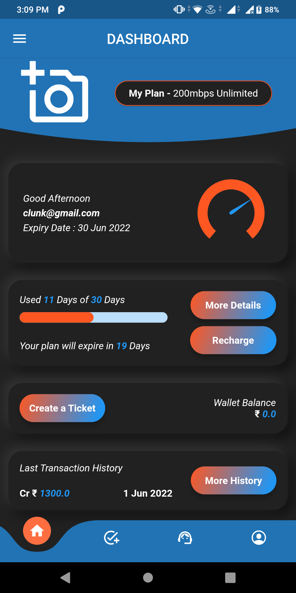
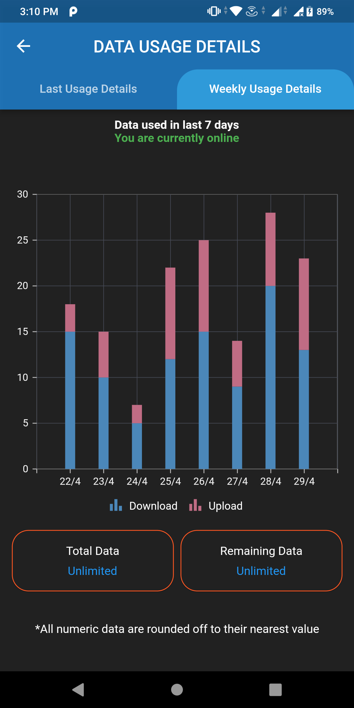

# 📡 TVNet – Internet Provider App (Customer Side)

TVNet is a **cross-platform Flutter application** designed for customers of an internet service provider.  
It allows users to manage their accounts, view plans, make payments, and access support seamlessly across **Android, iOS, Web, Windows, macOS, and Linux**.

 

---

## 🚀 Features

- 📋 **Account Management** – Sign up, log in, and manage customer details  
- 💳 **Payments** – Integrated with Razorpay for secure online transactions  
- 📡 **Plan Information** – Browse available internet plans and track active subscriptions  
- 📞 **Support** – Contact customer service directly from the app  
- 🌐 **Cross-Platform** – Built with Flutter, runs on mobile, desktop, and web  

---

## 🛠️ Tech Stack

- **Frontend & Logic:** [Flutter](https://flutter.dev/) (Dart)  
- **Mobile Platforms:** Android, iOS  
- **Desktop Platforms:** Windows, macOS, Linux  
- **Web Support:** Flutter Web  
- **Payment Gateway:** Razorpay Flutter SDK  
- **Languages Used:**  
  - Dart (80%)  
  - C++ (9%)  
  - CMake (7%)  
  - Swift, C, CSS (minor contributions)  

---

## 📂 Project Structure
tvnet/ 

├── android/          # Android-specific code 

├── ios/              # iOS-specific code 

├── lib/              # Main Flutter app source 

├── web/              # Web build 

├── windows/          # Windows build 

├── macos/            # macOS build 

├── linux/            # Linux build 

├── test/             # Unit & widget tests 

├── pubspec.yaml      # Dependencies & metadata 

└── razorpay-flutter-master.zip # Razorpay SDK

---

## ⚙️ Installation & Setup

1. **Clone the repository**
   ```bash
   git clone https://github.com/pankrulez/tvnet.git
   cd tvnet


- Install dependencies
flutter pub get
- Run the app
flutter run


- Build for specific platforms
- Android: flutter build apk
- iOS: flutter build ios
- Web: flutter build web
- Desktop: flutter build windows / flutter build macos / flutter build linux

🧪 Testing
Run unit and widget tests:
flutter test


📦 Dependencies
Key dependencies include:
- razorpay_flutter – Payment gateway integration
- flutter – Core framework
- Additional plugins listed in pubspec.yaml

🤝 Contributing
Contributions are welcome!
- Fork the repo
- Create a new branch (feature/your-feature)
- Commit changes
- Open a Pull Request

📜 License
This project is licensed under the MIT License – feel free to use and modify with attribution.

👨‍💻 Author
Developed by pankrulez

---
